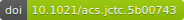

=======================================
PyEMMA - Emma's Markov Model Algorithms
=======================================

PyEMMA is a Python library for the estimation, validation and analysis Markov models
of molecular kinetics and other kinetic and thermodynamic models from molecular dynamics (MD)
data. Currently, PyEMMA has the following main features - please check out the IPython Tutorials for
examples:

* Featurization and MD trajectory input. Can read all commonly used MD formats.
* Time-lagged independent component analysis (TICA).
* Clustering / state space discretization.
* Markov state model (MSM) estimation and validation and Bayesian estimation of MSMs.
* Computing Metastable states and structures with Perron-cluster cluster analysis (PCCA).
* Systematic coarse-graining of MSMs to transition models with few states.
* Hidden Markov Models (HMM) and Bayesian estimation for HMMs.
* Extensive analysis options for MSMs and HMMs, e.g. calculation of committors, mean first passage times,
  transition rates, experimental expectation values and time-correlation functions, etc.
* Transition Path Theory (TPT).
* Plotting functions for data visualization and production of publishable figures.

Technical features:

* Code is implemented in Python (supports 2.7, 3.3/3.4) and C.
* Runs on Linux (64 bit), Windows (32 or 64 bit) or MacOS (64 bit).
* MD data can be either loaded (fast processing but high memory requirements) or streamed (slower processing but
  low memory requirements).
* Modular and flexible object structure, consisting of data Transformers, model Estimators and Models.
* Basic compatibility with `scikit-learn <http://scikit-learn.org/>`_. More complete compatibility will follow.
* Code is hosted at `GitHub <http://github.com/markovmodel/PyEMMA/>`_ under the Lesser GNU public license (LGPL).
  Please post issues or reports there.
* Subscribe to the newsletter `here <https://lists.fu-berlin.de/listinfo/pyemma-newsletter#subscribe>`_. News will be sent only after major releases / fixes.

Citation |DOI for Citing PyEMMA|
--------------------------------

If you use PyEMMA in scientific software, please cite the following paper: ::

	@article{scherer_pyemma_2015,
		author = {Scherer, Martin K. and Trendelkamp-Schroer, Benjamin
                          and Paul, Fabian and Pérez-Hernández, Guillermo and Hoffmann, Moritz and
                          Plattner, Nuria and Wehmeyer, Christoph and Prinz, Jan-Hendrik and Noé, Frank},
		title = {{PyEMMA} 2: {A} {Software} {Package} for {Estimation},
                         {Validation}, and {Analysis} of {Markov} {Models}},
		journal = {Journal of Chemical Theory and Computation},
		volume = {11},
		pages = {5525-5542},
		year = {2015},
		issn = {1549-9618},
		shorttitle = {{PyEMMA} 2},
		url = {http://dx.doi.org/10.1021/acs.jctc.5b00743},
		doi = {10.1021/acs.jctc.5b00743},
		urldate = {2015-10-19},
		month = oct,
	}

Installation
============

.. toctree::
   :maxdepth: 2

   INSTALL
   Configuration

Documentation
=============

.. toctree::
   :maxdepth: 2

   api/index

Tutorials
=========

.. toctree::
   :maxdepth: 2

   ipython

Development
===========
.. toctree::
   :maxdepth: 2

   CHANGELOG
   DEVELOPMENT

Indices and tables
==================

* :ref:`genindex`
* :ref:`modindex`
* :ref:`search`

