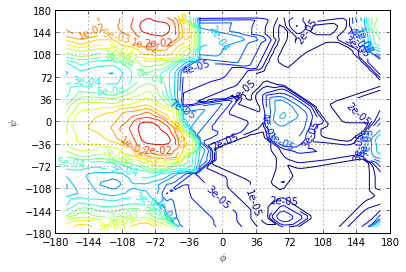
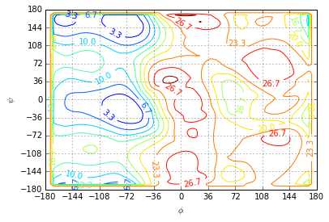
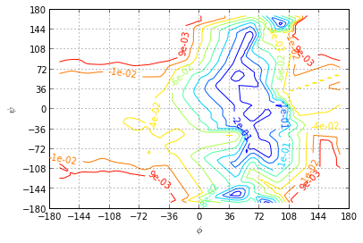
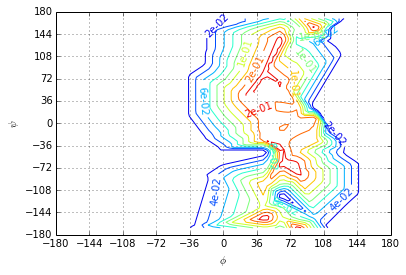
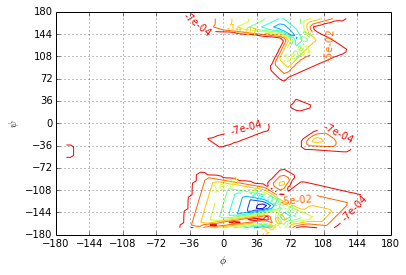
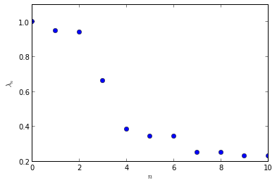
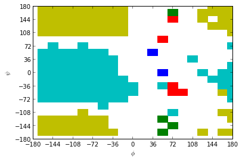

emma2 MSM-analysis for alanine-dipeptide
========================================

This notebook collects usage examples for MSM-analysis using members of
the emma2.msm.analysis package.

A given MSM, estimated from alanine-dipeptide simulation data at lagtime
:math:`\tau=6ps`, is used as an example to carry out analysis.

The necessary inputs are:

1. the transition matrix, 'T.dat'
2. the centers of the :math:`(\phi, \psi)` dihedral angle space regular
   grid discretization, 'grid\_centers20x20.dat'
3. the largest set of connected microstates, 'lcc.dat'

Auxiliary functions in 'plotting.py' are used to generate figures of the
estimated quantities.

Use ipythons magic % commands to activate plotting within notebook cells
------------------------------------------------------------------------

.. code:: python

    %matplotlib inline
Imports are ordered as
----------------------

1. standard library imports
2. third party imports
3. local application/library specific imports

.. code:: python

    import numpy as np
.. code:: python

    from emma2.msm.io import read_matrix
.. code:: python

    from emma2.msm.analysis import stationary_distribution, eigenvectors, eigenvalues, timescales, pcca
.. code:: python

    import plotting
Load necessary input data
-------------------------

Use emma2.msm.io.read\_matrix function to read dense arrays from ascii
files. The returned objects will be dense arrays (numpy.ndarray).

.. code:: python

    T=read_matrix('T.dat')
This notebook collects usage examples for MSM-analysis using members of
the emma2.msm.analysis package.

Starting from

.. code:: python

    centers=read_matrix('grid_centers20x20.dat')
The optional dtype (data-type) keyword allows you to specify the type of
the read data. The default value is dtype=float.

.. code:: python

    lcc=read_matrix('lcc.dat', dtype=int)
Use the integer values given by the largest connected set as indices to
"slice" the array of grid-center points. The returned array contains
only those centers corresponding to the mircrostates in the largest
connected set.

.. code:: python

    centers=centers[lcc, :]
Compute the stationary distribution using the
emma2.msm.analysis.stationary\_distribution method.

.. code:: python

    pi=stationary_distribution(T)
The (centers, pi) tuple is fed into an adapted plotting subroutine
producing a contour plot from the scattered data. Since scatterd data
can not directly be used to produce a contour plot over the whole
:math:`(\phi, \psi)`-plane the given data is interpolated onto a regular
grid before producing a contour plot. Some of the strange-looking low
probability iso-lines may be artefacts of the interpolation.
Interpolation on the level of free energies is probably a better idea.

.. code:: python

    plotting.stationary_distribution(centers, pi)

For :math:`T=300K` we have :math:`\beta=0.4 \frac{mol}{kJ}`. The
free-energy is defined as :math:`A_i=-\frac{1}{\beta} \log \pi_i`

.. code:: python

    A=-1.0/0.4*np.log(pi)
Since we can only estimate free-energy differences we set the
:math:`\min{A_i}=0`

.. code:: python

    A=A-A.min()
For plotting we chose the equally spaced contour levels in the interval
:math:`[0, 30] \frac{kJ}{mol}`. For the interpolation onto a regular
grid we chose cubic splines. Grid points that lie outside of the
convex-hull of the given center points are assigned the maximum value of
:math:`A`.

The plot shows the separation of the dihedral plane into a low
(free-)energy region $ 0 $ and the region of high free-energy
:math:`\phi >0`.

-  The low lying region contains three metastable sets seperated by a
   barrier of approximately :math:`4 \frac{kJ}{mol}` and approximately
   :math:`10 \frac{kJ}{mol}`.

-  There are two metastable sets in the high energy region seperated by
   a barrier of approximately :math:`7 \frac{kJ}{mol}`.

-  The barrier between the low energy and the high energy region is
   approximately :math:`23 \frac{kJ}{mol}`.

.. code:: python

    plotting.free_energy(centers, A, levels=np.linspace(0.0, 30.0, 10), method='cubic', fill_value=A.max())

Eigenvectors
------------

We compute the right eigenvectors corresponding to the 4 largest
eigenvalues.

.. code:: python

    R=eigenvectors(T, k=4)
The first eigenvector shows a sign change from the most stable region
with :math:`\phi \leq 0` to the :math:`\phi>0` region. The slowest
process corresponds to a transition between the two most stable states
and the metastable regions with :math:`\phi>0`.

.. code:: python

    ev=R[:, 1].real
    plotting.eigenvector(centers, ev, levels=np.linspace(ev.min(), ev.max(), 10))

The second eigenvector shows a sign change from :math:`\phi \leq 0` to
:math:`\phi>0`. The second slowest process is the transition between the
low-probability region :math:`\phi>0` and the high probability region
:math:`\phi \leq 0`.

.. code:: python

    ev=R[:, 2].real
    plotting.eigenvector(centers, ev, levels=np.linspace(ev.min(), ev.max(), 11), fmt='%.e')

The third eigenvector shows the transition process between the least
probable meta-stable state and the rest of the accessible state space.

.. code:: python

    ev=R[:, 3].real
    plotting.eigenvector(centers, ev, levels=np.linspace(ev.min(), ev.max(), 11), fmt='%.e')

Eigenvalues
-----------

Compute the 10 largest eigenvalues of the MSM

.. code:: python

    eigvals=eigenvalues(T)[0:11]

The first :math:`5` eigenvalues are purely real. The remaining
eigenvalues occur in complex-conjugate pairs. That is because :math:`T`
is a matrix with purely real entries.

.. code:: python

    eigvals

.. parsed-literal::

    array([ 1.00000000+0.j        ,  0.94808553+0.j        ,
            0.94092025+0.j        ,  0.66447475+0.j        ,
            0.38530146+0.j        ,  0.34550046+0.00929879j,
            0.34550046-0.00929879j,  0.24977533+0.25204877j,
            0.24977533-0.25204877j,  0.23257796+0.19019451j,
            0.23257796-0.19019451j])

There is a distinct gap in the spectrum betwenn the third and the fourth
eigenvalue.

.. code:: python

    plotting.eigenvalues(eigvals)

.. parsed-literal::

    /home/mi/trendelkamp/.local/lib/python2.7/site-packages/numpy/core/numeric.py:320: ComplexWarning: Casting complex values to real discards the imaginary part

Implied time scales
-------------------

Implied time scales are computed via msm.analysis.timescales. The
lagtime of the Markov model, :math:`\tau=6 ps`, can be specified via the
optional keyword tau. The default value is tau=1.

.. code:: python

    ts=timescales(T, k=5, tau=6)
.. code:: python

    ts

.. parsed-literal::

    array([          inf,  112.54805277,   98.52720209,   14.67859726,
              6.29109374])

PCCA
----

Ufortunately we seem to have a bug in the current implementation. So
that pcca(T, 5) will produce a nasty stack trace. In stead we load the
membership computed by a MATLAB script to visualize the result that
should have been produced.

.. code:: python

    membership=np.loadtxt('membership.dat')
.. code:: python

    membership_crisp=np.where(membership>0.75)
PCCA gives accurate memberships for the high probability region.
Assigning correct memberships for the low probability states,
:math:`\phi>0`, is problematic.

.. code:: python

    plotting.pcca(centers, membership_crisp)

Summary
-------

The emma2.msm.analysis module can be used to analyse an estimated
transition matrix. Starting from the transition matrix :math:`T` It is
possible to

-  compute the stationary vector :math:`\pi` to analyze the free-energy
   landscape given suitable (low-dimensional) coordinates
-  compute the right eigenvectors to investigate slowest dynamical
   processes
-  compute eigenvalues and time scales as quantitative information about
   system-dynamics

The emma2.msm-API is designed to allow fast and flexible scripting of
the whole estimation and analysis process. There is a multitude of
functions for MSM analysis provided in the emma2.msm.analysis module.
Further functions are

-  checks for stochasticity, ergodicity, etc.
-  commitor computation
-  TPT
-  mean-first-passage time (mfpt) computations
-  fingerprint: expectation and autocorrelation
-  decompositions in eigenvalues, left, and right eigenvectors

We are happy for your feedback and suggestions. Please feel free to
contact our mailing list at emma@lists.fu-berlin.de

