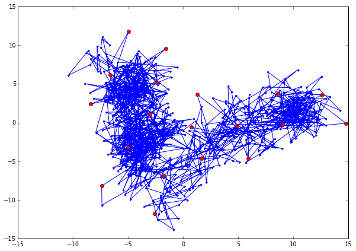
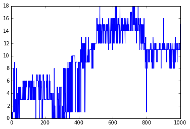

.. code:: python

    ##########################################
    # IMPORT ALL REQUIRED PACKAGES
    ##########################################
    # system
    import os
    import math
    # numerics 
    import numpy as np
    import scipy.sparse as sparse
    from scipy.sparse.base import issparse
    # iPython 
    from IPython.display import display
    # matplotlib
    import matplotlib.pyplot as plt
    %pylab inline
    # 3D plot
    from mpl_toolkits.mplot3d import Axes3D
    #emma imports
    import emma2.coordinates.io as coorio
    import emma2.coordinates.transform as coortrans
    import emma2.coordinates.clustering as cluster
    import emma2.msm.io as msmio
    import emma2.msm.estimation as msmest
    import emma2.msm.analysis as msmanal
    import emma2.util.pystallone as stallone

.. parsed-literal::

    Populating the interactive namespace from numpy and matplotlib

k-means clustering
------------------

.. code:: python

    traj = coorio.read_traj("./resources/Trypsin_pc12.dat")
.. code:: python

    # cluster from file
    kmeans = cluster.kmeans("./resources/Trypsin_pc12.dat", 20, maxiter=5)
.. code:: python

    figure(figsize=(10,7))
    plot(traj[:,0],traj[:,1],marker=".")
    centers = kmeans.clustercenters()
    plot(centers[:,0],centers[:,1],marker="o",linewidth=0,color='red')

.. parsed-literal::

    [<matplotlib.lines.Line2D at 0x10e02aed0>]

regspace clustering
-------------------

.. code:: python

    # cluster from file
    regspace = cluster.regspace("./resources/Trypsin_pc12.dat", 4.0)
.. code:: python

    figure(figsize=(10,7))
    plot(traj[:,0],traj[:,1],marker=".")
    centers = regspace.clustercenters()
    plot(centers[:,0],centers[:,1],marker="o",linewidth=0,color='red')

.. parsed-literal::

    [<matplotlib.lines.Line2D at 0x10d75d8d0>]

Cluster Assignment
------------------

.. code:: python

    dtraj = cluster.assign("./resources/Trypsin_pc12.dat", regspace, "./resources/Trypsin_pc12.dtraj")
.. code:: python

    plot(range(len(dtraj)),dtraj)

.. parsed-literal::

    [<matplotlib.lines.Line2D at 0x11c5c3810>]

.. code:: python

    
.. code:: python

    