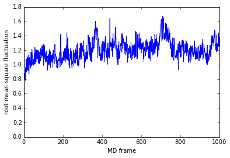
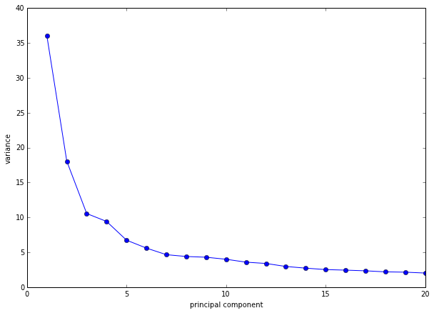
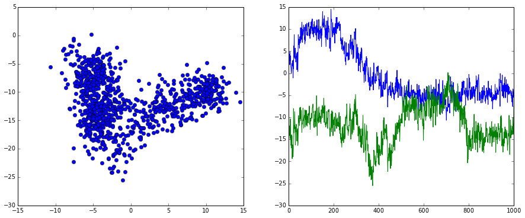
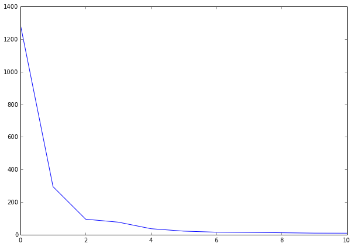
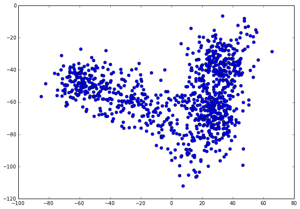
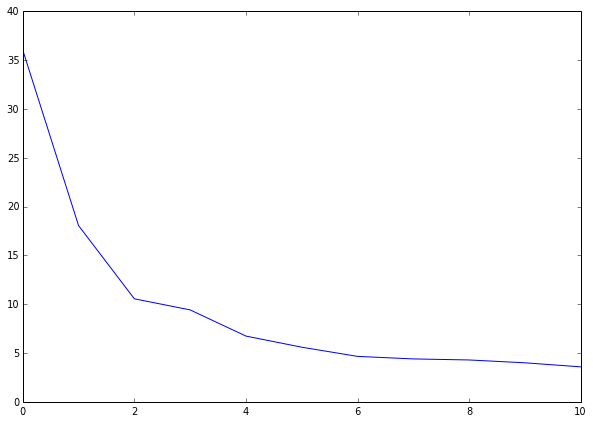
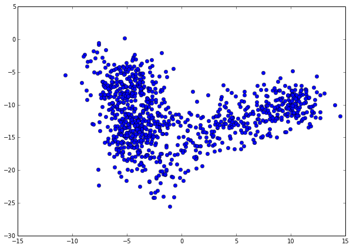

Tutorial: Coordinate IO and transformation
==========================================

.. code:: python

    ##########################################
    # IMPORT ALL REQUIRED PACKAGES
    ##########################################
    # system
    import os
    import math
    # numerics 
    import numpy as np
    import scipy.sparse as sparse
    from scipy.sparse.base import issparse
    # iPython 
    from IPython.display import display
    # matplotlib
    import matplotlib.pyplot as plt
    %pylab inline
    # 3D plot
    from mpl_toolkits.mplot3d import Axes3D
    #emma imports
    import emma2.coordinates.io as coorio
    import emma2.coordinates.transform as coortrans
    import emma2.msm.io as msmio
    import emma2.msm.estimation as msmest
    import emma2.msm.analysis as msmanal
    import emma2.util.pystallone as stallone

.. parsed-literal::

    2014-02-02 13:05:17,587 emma2.util.pystallone DEBUG    init with options: "['-Xms64m', '-Xmx2000m', '-Djava.class.path=/Users/noe/Library/Enthought/Canopy_64bit/User/lib/python2.7/site-packages/Emma2-2.0-py2.7-macosx-10.6-x86_64.egg/emma2/util/../../lib/stallone/stallone-1.0-SNAPSHOT-jar-with-dependencies.jar/']"
    2014-02-02 13:05:17,588 emma2.util.pystallone DEBUG    default vm path: /System/Library/Frameworks/JavaVM.framework/JavaVM

.. parsed-literal::

    Populating the interactive namespace from numpy and matplotlib

Reading and writing coordinates
-------------------------------

Supports reading from dcds and xtcs, as well as writing to dcds

.. code:: python

    # Read Coordinates and print first frame
    reader = coorio.reader("./resources/Trypsin_Ca_dt1ns.dcd")
    X0 = reader.get(0)
    print shape(X0)
    print X0[0:2]

.. parsed-literal::

    (223, 3)
    [[  1.41799927  15.82899761  13.82300091]
     [  4.63500071  17.88100052  14.60400105]]

.. code:: python

    # load all
    trajCA = reader.load()
    print shape(trajCA)

.. parsed-literal::

    (1000, 223, 3)

.. code:: python

    # check performance
    %timeit reader.load()

.. parsed-literal::

    1 loops, best of 3: 355 ms per loop

.. code:: python

    # Load an atom selection
    sel = range(0,10)
    trajSome = reader.load(select=sel)
    print shape(trajSome)

.. parsed-literal::

    (1000, 10, 3)

.. code:: python

    # Load a frame selection
    sel = range(0,10)
    trajSparse = reader.load(frames=sel)
    print shape(trajSparse)

.. parsed-literal::

    (10, 223, 3)

.. code:: python

    # slice
    trajCA_10ns = trajCA[::10]
    np.shape(trajCA_10ns)

.. parsed-literal::

    (100, 223, 3)

.. code:: python

    # Write dcd
    coorio.write_traj("./resources/Trypsin_Ca_dt10ns.dcd",trajCA_10ns)
    # this has the same effect
    writer = coorio.writer("./resources/Trypsin_Ca_dt10ns.dcd",nframes=100,natoms=669)
    writer.addAll(trajCA_10ns)
    writer.close()
Reading and writing ASCII
-------------------------

ASCII coordinates are no difference. By default, tabulated ASCII files
are interpreted as a frame per line. Thus we cannot explicitly encode
coordinate tables such as Nx3. ASCII files are useful for transformed
data, such as angles, distances, principal components, etc.

In principle, python has more than enough support for reading and
writing ASCII files. The only reason why we offer it through the coorio
package is to allow coordinate manipulation using the same interface,
irrespective of the file format.

.. code:: python

    # Read Coordinates from a tabulated ASCII file
    reader = coorio.reader("./resources/dists.dat")
    print shape(reader.get(0))
    # load two coordinates
    trajXY = reader.load(select=[20,21])
    print np.shape(trajXY)

.. parsed-literal::

    (50,)
    (10000, 2)

.. code:: python

    # Write Coordinates to a tabulated ASCII file
    writer = coorio.writer("./resources/dists_2021.dat")
    writer.addAll(reader.load(select=[20,21]))
Note: data transfer across the python/Java interface is currently rather
slow. This slowdown arises currently on the python side, where the
operation '[:]' on JPype Arrays causes the slowdown. Perhaps this can be
circumvented somehow

Example: Converting dcd files to inner coordinates
--------------------------------------------------

.. code:: python

    # we define a coordinate transform
    Tdist = coortrans.createtransform_distances(range(0,10),range(0,4))
    print Tdist.dimension()

.. parsed-literal::

    40

.. code:: python

    Tdist.transform(trajCA[0])

.. parsed-literal::

    array([[  0.        ,   3.89483959,   6.76740704,   6.04940977],
           [  3.89483959,   0.        ,   3.89322406,   5.57087888],
           [  6.76740704,   3.89322406,   0.        ,   3.8473847 ],
           [  6.04940977,   5.57087888,   3.8473847 ,   0.        ],
           [  8.36291853,   8.81598837,   7.24059729,   3.85176863],
           [  9.8628023 ,  11.42134722,  10.73583039,   7.30271815],
           [ 10.88543338,  13.22971694,  12.87659444,   9.08907283],
           [ 14.20248929,  16.40501459,  15.86021981,  12.18621322],
           [ 17.4326806 ,  19.93961741,  19.55374657,  15.82268574],
           [ 18.32460717,  21.26139268,  21.23672663,  17.43523416]])

.. code:: python

    # and entire files
    infile = "./resources/Trypsin_Ca_dt1ns.dcd"
    outfile = "./resources/tmp.dat"
    # apply transformation Tdist to input file and write result to output file
    coortrans.transform_file(infile, Tdist, outfile, output_precision=(3,2))
    # check result
    print np.reshape(np.loadtxt(outfile)[0],(10,4))

.. parsed-literal::

    [[  0.     3.89   6.77   6.05]
     [  3.89   0.     3.89   5.57]
     [  6.77   3.89   0.     3.85]
     [  6.05   5.57   3.85   0.  ]
     [  8.36   8.82   7.24   3.85]
     [  9.86  11.42  10.74   7.3 ]
     [ 10.89  13.23  12.88   9.09]
     [ 14.2   16.41  15.86  12.19]
     [ 17.43  19.94  19.55  15.82]
     [ 18.32  21.26  21.24  17.44]]

.. code:: python

    # angular transforms
    Tangle = coortrans.createtransform_angles([[1,2,3],[2,3,4],[3,4,5],[4,5,6]])
    Tangle.transform(trajCA[0])

.. parsed-literal::

    array([  92.05670224,  140.2513967 ,  141.83900055,  112.21317265])

.. code:: python

    # dihedral transforms
    Tdih = coortrans.createtransform_dihedrals([[1,2,3,4],[2,3,4,5],[3,4,5,6],[4,5,6,7]])
    Tdih.transform(trajCA[0])

.. parsed-literal::

    array([ 115.44973935, -122.38561194,  -71.41519912, -147.097981  ])

.. code:: python

    # select all torsion angles along the backbone
    nCA = np.shape(trajCA)[1]
    sel_all_CA_dih = np.array([range(0,nCA-3),range(1,nCA-2),range(2,nCA-1),range(3,nCA)]).T
    Tdih_all = coortrans.createtransform_dihedrals(sel_all_CA_dih)
    print sel_all_CA_dih[0:5]
    print np.shape(sel_all_CA_dih)

.. parsed-literal::

    [[0 1 2 3]
     [1 2 3 4]
     [2 3 4 5]
     [3 4 5 6]
     [4 5 6 7]]
    (220, 4)

.. code:: python

    # compute all of them in memory
    coortrans.transform_trajectory(trajCA, Tdih_all)

.. parsed-literal::

    array([[   5.79648138,  115.44973935, -122.38561194, ...,   46.67044757,
              54.15632816,   49.77017596],
           [   4.81344747,  137.06825955, -122.78206478, ...,   46.04156477,
              45.77561761,   55.52262629],
           [  -7.06218365,  147.41632028, -122.40270235, ...,   51.40851078,
              53.50367969,   48.65770885],
           ..., 
           [  -0.41515509,  112.05424834, -112.76015713, ...,   45.88988206,
              93.87037102,   -3.04815753],
           [   8.40559218,  135.22588281, -136.0495758 , ...,   49.82805661,
              82.28013065,   22.55718028],
           [  -9.24265537,  120.45431041, -103.49853275, ...,   97.93863591,
             153.37465415,    9.21164237]])

.. code:: python

    # let's try the same on a file:
    infile = "./resources/Trypsin_Ca_dt1ns.dcd"
    outfile = "./resources/tmp2.dat"
    coortrans.transform_file(infile, Tdih_all, outfile, output_precision=(3,2))
Oh, my god. Writing from file to file is much faster than doing
everything in memory but through the python/java interface. This is
embarassing. We should really clean this up!

.. code:: python

    # Finally we try the minRMSD transform
    infile = "./resources/Trypsin_Ca_dt1ns.dcd"
    outfile = "./resources/tmp3.dat"
    T_minrmsd = coortrans.createtransform_minrmsd(trajCA[0])
    coortrans.transform_file(infile, T_minrmsd, outfile, output_precision=(3,2))
.. code:: python

    rmsf = np.loadtxt(outfile)
    plot(range(len(rmsf)),rmsf)
    xlabel('MD frame')
    ylabel('root mean square fluctuation')

.. parsed-literal::

    <matplotlib.text.Text at 0x11a8f6790>

That's fast. All file-based operations seem fine!

PCA
---

.. code:: python

    pca = coortrans.pca("./resources/Trypsin_Ca_dt1ns.dcd")
.. code:: python

    # Let's have a look at the eigenvalues
    ev = pca.eigenvalues()
    plot(range(1,len(ev)+1),ev,marker='o')
    xlim(0,20)
    xlabel('principal component')
    ylabel('variance')

.. parsed-literal::

    <matplotlib.text.Text at 0x1244dd6d0>

.. code:: python

    # The two first dimension contribute a lot of the variance. So let's project on these two
    pca.set_dimension(2) # we could have done this in the construction of pca already: coortrans.pca(input, ndim=2)
    # This is very slow due to reading. 
    Y = np.zeros((reader.size(), 2))
    for i in range(len(Y)):
        Y[i] = pca.transform(reader.get(i).flatten())
.. code:: python

    figure(figsize=(15,6))
    # scatter plot of pc1 and 2
    subplot2grid((1,2),(0,0))
    plot(Y[:,0],Y[:,1],marker='o',linewidth=0)
    # time trace
    subplot2grid((1,2),(0,1))
    plot(range(len(Y[:,0])),Y[:,0])
    plot(range(len(Y[:,1])),Y[:,1])

.. parsed-literal::

    [<matplotlib.lines.Line2D at 0x12629aa90>]

.. code:: python

    # PCA is also a transform and can be used to transform files
    coortrans.transform_file("./resources/Trypsin_Ca_dt1ns.dcd",pca,"./resources/Trypsin_pc12.dat")
TICA
----

.. code:: python

    tica = coortrans.tica("./resources/Trypsin_Ca_dt1ns.dcd")
.. code:: python

    evals = tica.eigenvalues()
    plot(range(len(evals)),evals)
    xlim(0,10)

.. parsed-literal::

    (0, 10)

.. code:: python

    # The two first dimension contribute a lot of the variance. So let's project on these two
    tica.set_dimension(2) # we could have done this in the construction of pca already: coortrans.pca(input, ndim=2)
    # This is very slow due to reading. 
    Y = np.zeros((reader.size(), 2))
    for i in range(len(Y)):
        Y[i] = tica.transform(reader.get(i).flatten())
.. code:: python

    figsize(10,7)
    plot(Y[:,0],Y[:,1],marker='o',linewidth=0)

.. parsed-literal::

    [<matplotlib.lines.Line2D at 0x11b493c90>]

PCA in memory
-------------

This is just a side note. Loading coordinates into memory and performing
PCA there is way faster (same with TICA). That means there's a
performance leak somewhere in the Java code.

.. code:: python

    trajCA = reader.load()
    X = np.reshape(trajCA,(1000,223*3))
.. code:: python

    mean = np.mean(X, axis=0)
    Cov = np.dot((X - mean).T,X - mean) / (1.0*len(X))
.. code:: python

    evals,evecs = np.linalg.eig(Cov)
.. code:: python

    plot(range(len(evals)),evals)
    xlim(0,10)

.. parsed-literal::

    (0, 10)

.. code:: python

    Y = np.zeros((reader.size(), 2))
    for i in range(len(Y)):
        Y[i] = np.dot(trajCA[i].flatten(),evecs[:,0:2])
.. code:: python

    figsize(10,7)
    plot(Y[:,0],Y[:,1],marker='o',linewidth=0)

.. parsed-literal::

    [<matplotlib.lines.Line2D at 0x12541b650>]

