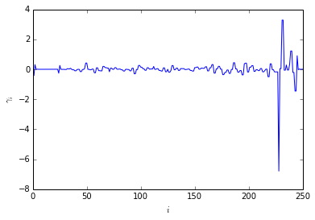
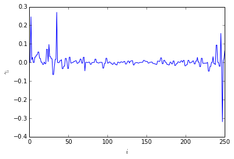

emma2 MSM-analysis for alanine-dipeptide III (fingerprints)
===========================================================

This notebook demonstrates usage of MSM for the computation of
fingerprints. Fingerprints allow to compare computer simulations to
experimental studies.

A given MSM, estimated from alanine-dipeptide simulation data at lagtime
:math:`\tau=6ps`, is used as an example to carry out analysis.

The necessary inputs are:

1. the transition matrix, 'T.dat'

2. the centers of the :math:`(\phi, \psi)` dihedral angle space regular
   grid discretization, 'grid\_centers20x20.dat'

3. the largest set of connected microstates, 'lcc.dat'

Auxiliary functions in 'plotting.py' are used to generate figures of the
estimated quantities.

Use ipythons magic % commands to activate plotting within notebook cells
------------------------------------------------------------------------

.. code:: python

    %matplotlib inline
Imports are ordered as
----------------------

1. standard library imports
2. third party imports
3. local application/library specific imports

.. code:: python

    import numpy as np
.. code:: python

    from emma2.msm.io import read_matrix
.. code:: python

    from emma2.msm.analysis import stationary_distribution, fingerprint_relaxation
.. code:: python

    import plotting
.. code:: python

    import util
Load necessary input data
-------------------------

Use emma2.msm.io.read\_matrix function to read dense arrays from ascii
files. The returned objects will be dense arrays (numpy.ndarray).

.. code:: python

    T=read_matrix('T.dat')
.. code:: python

    lcc=read_matrix('lcc.dat', dtype=int)
.. code:: python

    grid=read_matrix('grid_centers20x20.dat')
.. code:: python

    centers=grid[lcc, :]
Compute the stationary distribution

.. code:: python

    mu=stationary_distribution(T)
Metastable sets
---------------

The two metastable sets :math:`C_5` and :math:`C_7^{ax}` in the dihedral
angle plane are used to carry out the fingerprint analysis.

The :math:`C_5`-conformation can be found with high probability in
equilibrium while the :math:`C_7^{ax}` conformation is only rarely
visited.

.. code:: python

    C5=[20, 40, 36, 37, 38, 39, 56, 57, 58, 59]
.. code:: python

    C7ax=[253, 254, 273, 252, 272, 251, 271]
Use an utility object to map the states in the above set definitions to
the corresponding states in the largest connected component.

.. code:: python

    lccmap=util.MapToConnectedStateLabels(lcc)
.. code:: python

    P2map=lccmap.map(P2)
    C7axmap=lccmap.map(C7ax)    
Observables
-----------

Observable obs1 indicates the system being in conformation :math:`C_5`
while obs2 indicates the system to be in the :math:`C_7^{ax}`
conformation.

.. code:: python

    obs1=np.zeros(T.shape[0])
    obs1[C5map]=1.0
.. code:: python

    obs2=np.zeros(T.shape[0])
    obs2[C7axmap]=1.0
Initial distribution
--------------------

The initial distribution :math:`p_0` is concentrated on the
:math:`C_7^{ax}` conformation.

This distribution corresponds to an experiment in which the system has
been driven out of equilibrium and is relaxing from the :math:`C_7^{ax}`
conformation.

.. code:: python

    p0=np.zeros(T.shape[0])
    p0[C7axmap]=mu[C7axmap]/mu[C7axmap].sum()
Fingerprint relaxation
----------------------

Compute fingerprint for obs1.

The fingerprint spectrum shows large amplitudes only for very fast
processes. There is no slow process once the system reaches equilibrium
and frequently visits the conformation :math:`C_5`.

.. code:: python

     ts, a=fingerprint_relaxation(T, p0, obs1)    
.. code:: python

    plotting.amplitudes(a)

Compute fingerprint for obs2

The fingerprint shows large amplitudes for slow processes corresponding
to the relaxation of the system from the initial non-equilibrium
distribution :math:`p_0` towards equilibrium.

The value of the observable decays with the second slowest time scale
:math:`t_2` in the long run. This due to the fact that most of the
intial probability will be shifted to the high probaility conformations.

.. code:: python

    ts, a=fingerprint_relaxation(T, p0, obs2)
.. code:: python

    plotting.amplitudes(a)

.. code:: python

    