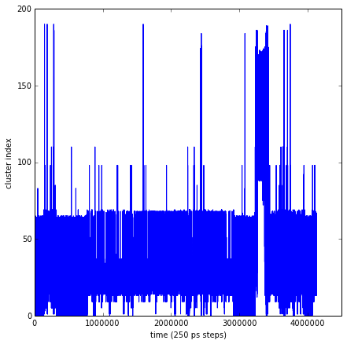
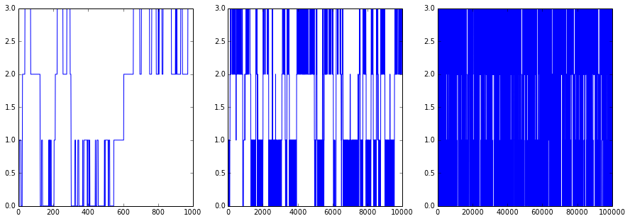
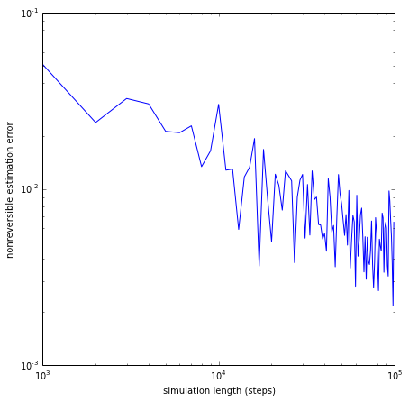
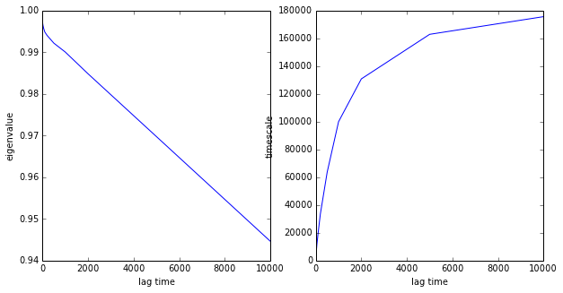
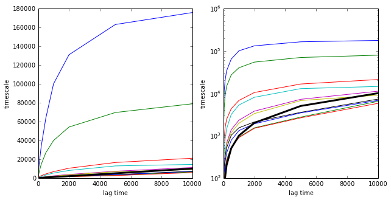
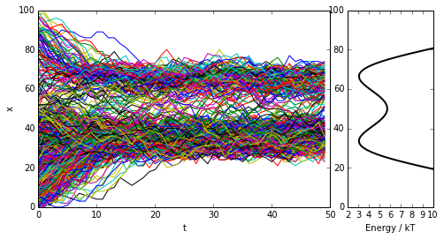

MSM Estimation with Emma2
=========================

lalala

.. code:: python

    ##########################################
    # IMPORT ALL REQUIRED PACKAGES
    ##########################################
    # system
    import os
    import math
    # numerics 
    import numpy as np
    import scipy.sparse as sparse
    from scipy.sparse.base import issparse
    # iPython 
    from IPython.display import display
    # matplotlib
    import matplotlib.pyplot as plt
    %pylab inline
    # 3D plot
    from mpl_toolkits.mplot3d import Axes3D
    #emma imports
    import emma2.msm.io as msmio
    import emma2.msm.estimation as msmest
    import emma2.msm.analysis as msmana
    import emma2.msm.generation as msmgen
    import emma2.util.pystallone as stallone

.. parsed-literal::

    Populating the interactive namespace from numpy and matplotlib

IO
--

We first read a discrete trajectory that has been generated by
clustering a TICA-projection of the 1 ms Anton BPTI trajectory:

.. code:: python

    dtraj_bpti = msmio.read_dtraj("./resources/bpti_tica2_regspace0.3.disctraj")
    print len(dtraj_bpti)
    print dtraj_bpti[0:20]

.. parsed-literal::

    4124963
    [0 2 2 3 4 2 0 2 7 1 0 7 6 0 1 3 3 1 2 2]

Although this is just a series of cluster indexes, let's have a look at
the trajectory in a plot. It's pretty clear that there is something
interested happening in the last third of the trajectory:

.. code:: python

    plot(range(len(dtraj_bpti)), dtraj_bpti)
    xticks(range(0,len(dtraj_bpti),1000000))
    xlabel('time (250 ps steps) ')
    ylabel('cluster index')

.. parsed-literal::

    <matplotlib.text.Text at 0x11962c250>

Trajectory generation
---------------------

Now we want to generate our own trajectory data. For starters, consider
the following simple 4x4 matrix which exhibits dynamics on three
different timescales:

.. code:: python

    T4 = np.array([[0.9, 0.1,  0.0,  0.0],
                 [0.1, 0.89, 0.01, 0.0],
                 [0.0, 0.01, 0.94, 0.05],
                 [0.0, 0.0,  0.05, 0.95]])
This matrix is stochastic (it's a transition matrix) - see:

.. code:: python

    # test function
    print "T is a transition matrix: ", msmana.is_transition_matrix(T4)
    # proof that this is true:
    print "because all its row sums are 1: ", np.sum(T4, axis=1)
    print "and all its elements are within: [", np.min(T4), ",", np.max(T4), "]"

.. parsed-literal::

    T is a transition matrix:  True
    because all its row sums are 1:  [ 1.  1.  1.  1.]
    and all its elements are within: [ 0.0 , 0.95 ]

Its stationary distribution is uniform:

.. code:: python

    mu = msmana.statdist(T4)
    print "Stationary distribution:", mu

.. parsed-literal::

    Stationary distribution: [ 0.25  0.25  0.25  0.25]

It's also reverisble matrix:

.. code:: python

    # test function
    print "T is a reversible matrix: ", msmana.is_reversible(T4)
    # proof that this is true:
    C = np.dot(np.diag(mu),T4)
    print "because its correlation matrix \n", C
    print "is symmetric to within numerical error of ", np.linalg.norm(C - C.transpose())

.. parsed-literal::

    T is a reversible matrix:  False
    because its correlation matrix 
    [[ 0.225   0.025   0.      0.    ]
     [ 0.025   0.2225  0.0025  0.    ]
     [ 0.      0.0025  0.235   0.0125]
     [ 0.      0.      0.0125  0.2375]]
    is symmetric to within numerical error of  2.40998608955e-16

Buhuuuu! This is wrong.

OK... Now we generate a trajectory from it:

.. code:: python

    figsize(15,5)
    dtraj_4_1K = msmgen.generate_traj(T4, 0, 1000)
    subplot2grid((1,3),(0,0))
    plot(range(len(dtraj_4_1K)), dtraj_4_1K)
    dtraj_4_10K = msmgen.generate_traj(T4, 0, 10000)
    subplot2grid((1,3),(0,1))
    plot(range(len(dtraj_4_10K)), dtraj_4_10K)
    dtraj_4_100K = msmgen.generate_traj(T4, 0, 100000)
    subplot2grid((1,3),(0,2))
    plot(range(len(dtraj_4_100K)), dtraj_4_100K)

.. parsed-literal::

    [<matplotlib.lines.Line2D at 0x1304fd710>]

Estimation
----------

First of all we have to count

.. code:: python

    C = msmest.cmatrix(dtraj_4_10K, 1)
    print C

.. parsed-literal::

      (0, 0)	2347.0
      (0, 1)	245.0
      (1, 0)	244.0
      (1, 1)	2063.0
      (1, 2)	27.0
      (2, 1)	26.0
      (2, 2)	2310.0
      (2, 3)	134.0
      (3, 2)	134.0
      (3, 3)	2469.0

Mind that this count matrix is now a sparse matrix! At the moment count
matrices are sparse whereas subsequent operations (estimation, analysis)
will work on either sparse or dense matrices, depending on the input
matrix (although not all combinations are implemented yet).

This may be changed in the future because for small matrices, dense is
the most efficient option.

Next, we estimate the transition matrix - either reversible or
nonreversibly:

.. code:: python

    Test_nonrev = msmest.transition_matrix(C)
    print Test_nonrev.toarray()
    print
    Test_rev = msmest.transition_matrix(C,reversible=True)
    print Test_rev.toarray()
    print

.. parsed-literal::

    [[ 0.9054784   0.0945216   0.          0.        ]
     [ 0.10454156  0.88389032  0.01156812  0.        ]
     [ 0.          0.01052632  0.93522267  0.05425101]
     [ 0.          0.          0.05147906  0.94852094]]
    
    [[ 0.90546267  0.09453733  0.          0.        ]
     [ 0.10452063  0.88387636  0.01160301  0.        ]
     [ 0.          0.01049331  0.93523487  0.05427182]
     [ 0.          0.          0.05146097  0.94853903]]
    

As you can see the results are almost identical (the differences are due
to numerical reasons). This is because any tridiagonal transition matrix
is reversible with respect to its stationary distribution - but we will
see differences later.

We now show that the estimate converges to the correct matrix for long
sampling:

.. code:: python

    lengths = range(1000, 100000, 1000)
    errors_nonrev = []
    for l in lengths:
        dtraj_4_var = msmgen.generate_traj(T4, 0, l)
        Cest_4_var = msmest.count_matrix(dtraj_4_var, 1)
        Test_4_var = msmest.transition_matrix(Cest_4_var)
        error_nonrev = np.linalg.norm(Test_4_var - T4)
        errors_nonrev.append(error_nonrev)
    # do a log-log plot of the error
    figsize(7,7)
    loglog(lengths, errors_nonrev)
    xlabel('simulation length (steps)')
    ylabel('nonreversible estimation error')

.. parsed-literal::

    <matplotlib.text.Text at 0x1197c4890>

Implied timescales
------------------

Now we conduct the implied timescales test using the BPTI trajectory.
There'll be a few high-level commands (certainly for the shell, maybe
for the python API level as well) later, but right now you build things
like implied timescales yourselves:

.. code:: python

    lags = [1,2,5,10,20,50,100,200,500,1000,2000,5000,10000]
    nits = 10
    evs = np.zeros((len(lags),nits))
    its = np.zeros((len(lags),nits))
    for i in range(len(lags)):
        lag = lags[i]
        # count matrix at lag tau
        Clag_sparse = msmest.cmatrix(dtraj_bpti,lag)
        # let's stay dense
        Clag = Clag_sparse.toarray()
        # estimate transition matrix
        Tlag = msmest.transition_matrix(Clag, lag)
        # eigenvalues
        evs[i,:] = msmana.eigenvalues(Tlag)[1:nits+1]
        # timescales
        its[i,:] = msmana.timescales(Tlag, lag)[1:nits+1]

.. parsed-literal::

    -c:14: ComplexWarning: Casting complex values to real discards the imaginary part

Let's have a look at the first eigenvalue and timescale

.. code:: python

    # plot eigenvalue
    figsize(10,5)
    subplot2grid((1,2),(0,0))
    plot(lags, evs[:,0])
    xlabel('lag time')
    ylabel('eigenvalue')
    # plot its
    figsize(10,5)
    subplot2grid((1,2),(0,1))
    plot(lags, its[:,0])
    xlabel('lag time')
    ylabel('timescale')

.. parsed-literal::

    <matplotlib.text.Text at 0x119dd2510>

You can nicely see the problem with this kind of MSM estimation: the
eigenvalue does not decay exponentially for all tau, but rather drops
(due to fast processes that are not resolved by the discretization) to
some value smaller than 1, and then decays exponentially with the
timescale of interest. Hence we have slow convergence in tau.

Let's look at all timescales

.. code:: python

    # plot its
    figsize(10,5)
    subplot2grid((1,2),(0,0))
    for i in range(nits):
        plot(lags, its[:,i])
    # plot forbidden region
    plot(lags,lags,color='black', linewidth=3)
    xlabel('lag time')
    ylabel('timescale')
    # logarithmically
    figsize(10,5)
    subplot2grid((1,2),(0,1))
    for i in range(nits):
        plot(lags, its[:,i])
    # plot forbidden region
    plot(lags,lags,color='black', linewidth=3)
    semilogy()
    ylim(100,1000000)
    xlabel('lag time')
    ylabel('timescale')

.. parsed-literal::

    <matplotlib.text.Text at 0x131c5bc90>

Example: Double-well potential
------------------------------

Next we probe a more complex quasi-continuous example: a metastable
double-well potential with 100 microstates, out of which about 60 are
populated with significant probability. We coarse-grain the double-well
to a few (2 or more) sets. In the coarse-grained state space is usually
connected.

.. code:: python

    # load T matrix
    T_doublewell = msmio.read_matrix('./resources/2well.T',mode='sparse')
    pi_doublewell = msmanal.statdist(T_doublewell.toarray())
    U_doublewell = -np.log(pi_doublewell)
.. code:: python

    trajs = []
    for i in range(500):
        trajs.append(msmgen.generate_traj(T_doublewell.toarray(), random.randint(0,50), 500, dt=10))
    for i in range(100):
        trajs.append(msmgen.generate_traj(T_doublewell.toarray(), random.randint(50,100), 500, dt=10))
.. code:: python

    figure(figsize=(8,4))
    subplot2grid((1,4),(0,0),colspan=3)
    for traj in trajs:
        plot(range(len(traj)), traj)
    plt.xlabel('t')
    plt.ylabel('x')
    subplot2grid((1,4),(0,3))
    plot(U_doublewell,range(len(U_doublewell)), linewidth=2, color='black')
    xlim([2,10])
    plt.xlabel('Energy / kT')

.. parsed-literal::

    <matplotlib.text.Text at 0x14c816390>

.. code:: python

    # define discretization
    def discretize(_trajs, _bounds):
        """discretizes the trajectories into two states split at point p"""
        _dtrajs = []
        for _traj in _trajs:
            _dtraj = np.digitize(_traj,_bounds)
            _dtrajs.append(_dtraj)
        return _dtrajs
.. code:: python

    # DECENT DISCRETIZATION
    def its_doublewell(lags,discretization):
        dtrajs_1 = discretize(trajs,discretization)
        nits = len(discretization)
        its = np.zeros((len(lags),nits))
        for i in range(len(lags)):
            lag = lags[i]
            # count matrix
            Z = msmest.cmatrix(dtrajs_1, lag)
            # connected count matrix
            #giant = msmest.largest_connected_set(Z)
            #Z = msmest.connected_cmatrix(Z)
            # densify!
            Z = Z.toarray()
            # estimate
            T = msmest.transition_matrix(Z, reversible=True)
            # timescales
            its[i,:] = msmana.timescales(T, lag)[1:nits+1]
        return its
.. code:: python

    # DECENT discretization
    lags = range(1,40)
    its2 = its_doublewell(lags,[50])
    # GREAT discretization
    lags = range(1,40)
    its8 = its_doublewell(lags,[30,40,45,50,55,60,70])
.. code:: python

    subplot2grid((1,2),(0,0))
    plot(lags,its2)
    subplot2grid((1,2),(0,1))
    plot(lags,its8)

.. parsed-literal::

    [<matplotlib.lines.Line2D at 0x143bb6650>,
     <matplotlib.lines.Line2D at 0x143c271d0>,
     <matplotlib.lines.Line2D at 0x143c27410>,
     <matplotlib.lines.Line2D at 0x143c275d0>,
     <matplotlib.lines.Line2D at 0x143c27790>,
     <matplotlib.lines.Line2D at 0x143c27950>,
     <matplotlib.lines.Line2D at 0x143c27b10>]

.. image:: msm_estimation_files/msm_estimation_36_1.png

.. code:: python

    # ANALYZE ERRORS!!!!

Next - analyze errors, uncertainties

.. code:: python

    