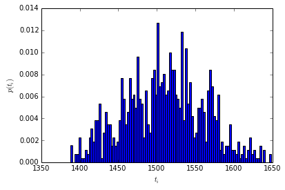
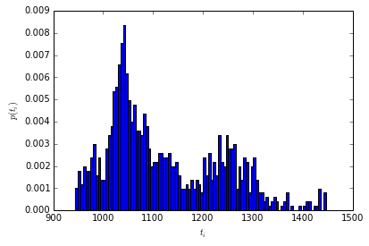
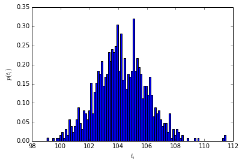

emma2 transition matrix sampling
================================

This notebook demonstrates usage of the transition matrix sampling
algorithms

A given count matrix, 'C.npy', estimated from alanine-dipeptide
simulation data at lagtime :math:`\tau=6ps` is used as input for the
transition matrix sampling algorithm.

Auxiliary functions in 'plotting.py' are used to generate figures of the
estimated quantities.

Use ipythons magic % commands to activate plotting within notebook cells
------------------------------------------------------------------------

.. code:: python

    %matplotlib inline
Imports are ordered as
----------------------

1. standard library imports
2. third party imports
3. local application/library specific imports

.. code:: python

    import numpy as np
.. code:: python

    from emma2.msm.io import read_matrix
.. code:: python

    from emma2.msm.estimation import tmatrix, tmatrix_sampler, prior_rev, prior_const
.. code:: python

    from emma2.msm.analysis import timescales
.. code:: python

    import plotting
Load necessary input data
-------------------------

Use emma2.msm.io.read\_matrix function to read dense arrays from ascii
files. The returned object will be a dense array (numpy.ndarray).

.. code:: python

    C=read_matrix('C_sampling.dat')
.. code:: python

    mu=read_matrix('mu_wham.dat')
Parameter definitions
---------------------

Lagtime, :math:`\tau=6ps`

.. code:: python

    tau=6
Number of implied time scales, :math:`k=4`

.. code:: python

    k=4
Number of burn in steps to equilibrate sampler

.. code:: python

    dM=100000
Number of samples to generate

.. code:: python

    N=1000
Number of MCMC-steps to take between samples

.. code:: python

    dN=10000
Non reversible
--------------

Estimate maximum likelihood transition matrix and compute values of
implied time-scales as reference for sampling

.. code:: python

    T_nrev=tmatrix(C)
.. code:: python

    ts_nrev=timescales(T_nrev, k=k, tau=tau)
.. code:: python

    print ts_nrev

.. parsed-literal::

    [           inf  1506.65156759    70.16511749    37.0941437 ]

Create a emma2.msm.estimation.tmatrix\_sampler object

1. Add constanpt prior :math:`b_{ij}=-1` to count matrix
2. Set the maximum likelihood estimator :math:`T_{nrev}` as starting
   point :math:`T_0` of the chain

The constant prior ensures that the mean value of the chain corresponds
to the maximum likelihood estimator for :math:`N \rightarrow \infty`

.. code:: python

    sampler_nrev=tmatrix_sampler(C+prior_const(C, alpha=-1.0), T0=T_nrev)
Array for time scale sample

.. code:: python

    ts_sample_nrev=np.zeros((N, k))
Burn-in period of MCMC-sampler

.. code:: python

    sampler_nrev.sample(dM)

.. parsed-literal::

    array([[ 0.,  0.,  0., ...,  0.,  0.,  0.],
           [ 0.,  0.,  0., ...,  0.,  0.,  0.],
           [ 0.,  0.,  0., ...,  0.,  0.,  0.],
           ..., 
           [ 0.,  0.,  0., ...,  0.,  0.,  0.],
           [ 0.,  0.,  0., ...,  0.,  0.,  0.],
           [ 0.,  0.,  0., ...,  0.,  0.,  0.]])

Sample transition matrix and compute :math:`k` leading time scales for
lagtime :math:`\tau`

.. code:: python

    for i in range(N):
        T=sampler_nrev.sample(dN)
        ts_sample_nrev[i,:]=timescales(T, k=k, tau=tau)
.. code:: python

    print ts_sample_nrev

.. parsed-literal::

    [[           inf  1523.62053936    70.18136883    36.13058926]
     [           inf  1531.81561322    70.30761513    36.61715594]
     [           inf  1530.25508768    70.23810895    36.43559241]
     ..., 
     [           inf  1510.36205777    70.69333587    38.3504228 ]
     [           inf  1515.47253149    70.66470076    37.97898957]
     [           inf  1508.91923743    70.61223017    38.2184552 ]]

Sample mean :math:`\mathbf{E}(t_i)`

.. code:: python

    print np.mean(ts_sample_nrev[:,1:], axis=0)

.. parsed-literal::

    [ 1509.89182529    70.08466444    36.56764228]

Sample standard deviation :math:`std(t_i)`

.. code:: python

    print np.std(ts_sample_nrev[:,1:], axis=0)

.. parsed-literal::

    [ 52.18985356   0.47968079   1.788456  ]

Histogram of sample of largest implied time scales

.. code:: python

    plotting.timescale_histogram(ts_sample_nrev[:,1])

Reversible
----------

Estimate maximum likelihood transition matrix and compute values of
implied time-scales as reference for sampling

.. code:: python

    T_rev=tmatrix(C, reversible=True)
.. code:: python

    ts_rev=timescales(T_rev, k=k, tau=tau)
.. code:: python

    print ts_rev

.. parsed-literal::

    [           inf  1518.29184928    70.20868863    37.64215705]

Create a emma2.msm.estimation.tmatrix\_sampler object

1. Add reversible prior :math:`b_{ij}=-1` if :math:`i \leq j` to count
   matrix
2. Set the maximum likelihood estimator :math:`T_{rev}` as starting
   point :math:`T_0` of the chain

The reversible prior respects the fact that the degree of freedoms for
the sampler correspond to the upper triangular part of the transition
matrix

.. code:: python

    sampler_rev=tmatrix_sampler(C+prior_rev(C), reversible=True, T0=T_rev)
Array for time scale sample

.. code:: python

    ts_sample_rev=np.zeros((N, k))
Burn-in period of MCMC-sampler

.. code:: python

    sampler_rev.sample(dM)

.. parsed-literal::

    array([[ 0.,  0.,  0., ...,  0.,  0.,  0.],
           [ 0.,  0.,  0., ...,  0.,  0.,  0.],
           [ 0.,  0.,  0., ...,  0.,  0.,  0.],
           ..., 
           [ 0.,  0.,  0., ...,  0.,  0.,  0.],
           [ 0.,  0.,  0., ...,  0.,  0.,  0.],
           [ 0.,  0.,  0., ...,  0.,  0.,  0.]])

.. code:: python

    for i in range(N):
        T=sampler_rev.sample(dN)
        ts_sample_rev[i, :]=timescales(T, k=k, tau=tau)
.. code:: python

    print ts_sample_rev

.. parsed-literal::

    [[           inf  1445.05681096    69.13636023    33.68592379]
     [           inf  1446.34034439    69.28107279    33.71247534]
     [           inf  1431.54962644    69.24171718    32.75713451]
     ..., 
     [           inf  1147.15246327    66.49330814    33.63566176]
     [           inf  1143.60399565    66.42440015    33.21366407]
     [           inf  1139.75983395    66.32153454    33.14362809]]

Sample mean :math:`\mathbf{E}(t_i)`

.. code:: python

    print np.mean(ts_sample_rev[:,1:], axis=0)

.. parsed-literal::

    [ 1119.74020716    66.47766601    32.3483812 ]

Sample standard deviation :math:`std(t_i)`

.. code:: python

    print np.std(ts_sample_rev[:,1:], axis=0)

.. parsed-literal::

    [ 111.22952655    0.60404229    1.64835998]

Histogram of sample of largest implied time scales

.. code:: python

    plotting.timescale_histogram(ts_sample_rev[:,1])

Reversible with fixed stationary vector :math:`\mu`
---------------------------------------------------

Estimate maximum likelihood transition matrix and compute values of
implied time-scales as reference for sampling.

We need to add a small offset to the diagonal in order to guarantee
convergence of the estimation algorithm

.. code:: python

    T_mu=tmatrix(C+1e-10, reversible=True, mu=mu)
.. code:: python

    ts_mu=timescales(T_mu, k=k, tau=tau)
.. code:: python

    print ts_mu

.. parsed-literal::

    [           inf  1327.81195275    70.78464007    38.55859591]

Create a emma2.msm.estimation.tmatrix\_sampler object

1. Add reversible prior :math:`b_{ij}=-1` if :math:`i \leq j` to count
   matrix
2. Set the maximum likelihood estimator :math:`T_{mu}` as starting point
   :math:`T_0` of the chain

The reversible prior respects the fact that the degree of freedoms for
the sampler correspond to the upper triangular part of the transition
matrix

.. code:: python

    sampler_mu=tmatrix_sampler(C, reversible=True, mu=mu, T0=T_mu)
Array for time scale sample

.. code:: python

    ts_sample_mu=np.zeros((N, k))
Burn-in period of MCMC-sampler

.. code:: python

    sampler_mu.sample(dM)

.. parsed-literal::

    array([[  3.15211269e-03,   6.54292774e-13,   7.85841550e-06, ...,
              2.80143228e-05,   3.32466012e-04,   3.17409915e-05],
           [  1.01338959e-11,   2.81134449e-03,   7.51308799e-06, ...,
              1.02442096e-03,   1.33563066e-03,   5.53528321e-04],
           [  1.40345859e-03,   8.66320875e-05,   9.15839500e-03, ...,
              1.72201038e-03,   7.27324726e-05,   5.28386782e-08],
           ..., 
           [  9.74181306e-04,   2.30003161e-03,   3.35297882e-04, ...,
              5.47792917e-03,   2.46637650e-04,   2.40901329e-03],
           [  4.58266287e-03,   1.18864652e-03,   5.61350857e-06, ...,
              9.77620647e-05,   1.38164571e-04,   9.00568885e-06],
           [  6.26774598e-04,   7.05710260e-04,   5.84222429e-09, ...,
              1.36795065e-03,   1.29014101e-05,   5.45842039e-04]])

.. code:: python

    for i in range(N):
        T=sampler_mu.sample(dN)
        ts_sample_mu[i, :]=timescales(T, k=k, tau=tau)
Sample mean :math:`\mathbf{E}(t_i)`

.. code:: python

    print np.mean(ts_sample_mu[:,1:], axis=0)

.. parsed-literal::

    [ 104.20588998   63.29244331   11.14867187]

Sample standard deviation :math:`std(t_i)`

.. code:: python

    print np.std(ts_sample_mu[:,1:], axis=0)

.. parsed-literal::

    [ 1.75674698  0.37978198  0.34169155]

Histogram of sample of largest implied time scales

.. code:: python

    plotting.timescale_histogram(ts_sample_mu[:,1])

Summary
-------

The emma2.msm.estimation.tmatrix\_sampler can be used to obtain detailed
information about the statisatical uncertainty of observables of
interest, especially obervables of dynamical properties of the studied
system such as implied time scales.

.. code:: python

    